## School Dashboard Demo Project
### Spring Boot + MySQL + Junit 5 + CircleCI & Swagger UI Integration

School Dashboard is demo project which explain spring boot framework basic setup along with Swagger UI 
and Circle CI integratopm where we can execute Junit test cases to verify build quality. 

### Overview:

### Project Layers:

| Layers | Available | Technology |
| ------ | ------ | ------ |
| Client side layer | Yes | JQuery & Bootstrap |
| Server Web layer | Yes | Spring Boot |
| Service layer | Yes | Core Java & Spring |
| Database layer | Yes | MySQL |

### Technology Stack :

| Technology | Version |
| ------- | ------- |
| Core Java | Adopt Open JDK 8 |
| Bootstrap | 3.0 |
| Spring Boot | 2.3.0.RELEASE|
| JUnit | 5.0 |
| MySQL | 5.7.30 |

### Tools :

| Tool | Version |
| ------- | ------- |
| Maven | Apache Maven 3.5.0 |
| Editor  | Spring Tool Suite 4 |
| CI Env | Circle CI |

### Project Description:

- Dashboard
  - Showing school location
  - Latest news of current academic year
  - Current academic year statistics for students staffs etcs
  - Todays administrative schedule with timeline.
- Notice List
  - Display all notices
  - Drill-down functionality from notice list to check notice details
- Gallery
  - School function gallery
  - Anual function gallery
  - Festival gallery
- New Notice high-ligher

### Architecture Overview:

  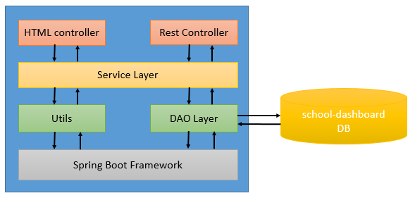

### Application configuration:
 - Edit **_application.properties**_ file

 ```markdown
#spring mvc configutation
spring.mvc.view.prefix: /WEB-INF/jsp/
spring.mvc.view.suffix: .jsp

#spring database configuration
spring.datasource.url=jdbc:mysql://localhost:3306/school-dashboard
spring.datasource.username=school-dashboard
spring.datasource.password=school-dashboard
spring.datasource.tomcat.max-wait=20000
spring.datasource.tomcat.max-active=50
spring.datasource.tomcat.max-idle=20
spring.datasource.tomcat.min-idle=15 

#server port
server.port=8080

#application context path
server.servlet.context-path=/school-dashboard

#spring related configuration
spring.application.name=school-dashboard
 ```

 - Database table creation script - ${project.home}\src\main\resources\create-table.sql
 
 - Sample data population script - ${project.home}\src\main\resources\populate-sample-data
 
### Configuring Project into Eclipse STS:
 - In Eclipse STS, select the File menu and then select Import… You will see:
 
 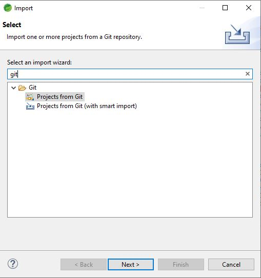
 
 - Select Projects from Git, click on Next, and you will now see:
 
 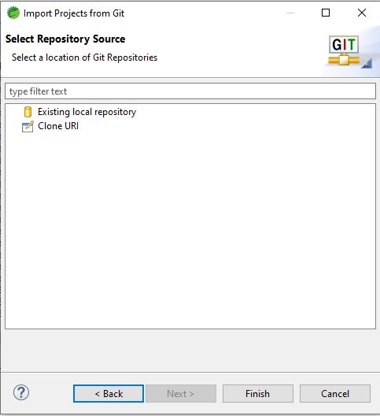
 
 - Select Clone URI and you will see:
 
 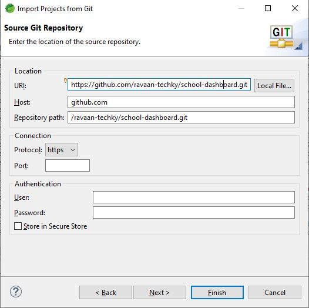

 ```markdown
All you need to enter on this form is the https address, -
https://github.com/ravaan-techky/school-dashboard.git 
Once you do, most of the remaining fields are filled in. You only need a 
user name and password. If you plan to commit back to the repository, 
assuming you have the necessary privileges. **Note:** If you already copy 
above mention URL then it will paste automatically.
 ```
- The next dialog allows you to select either the master or a branch of the project.
 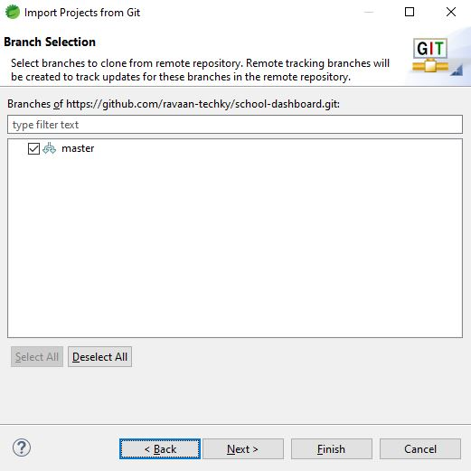

- The next action is to choose a wizard for importing the repository.
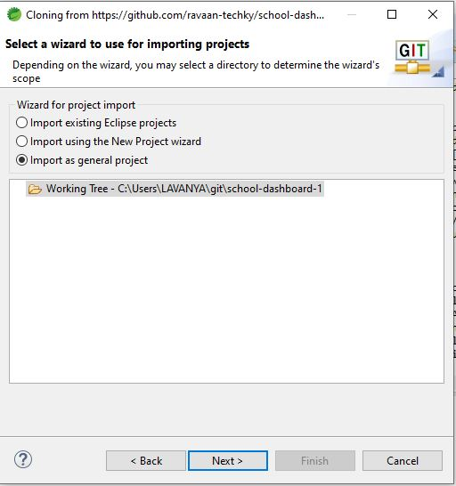

- Now we need to give the project a name. Eclipse chooses the git name and that is usually sufficient. Click on Finish and you should see your project in Eclipse.
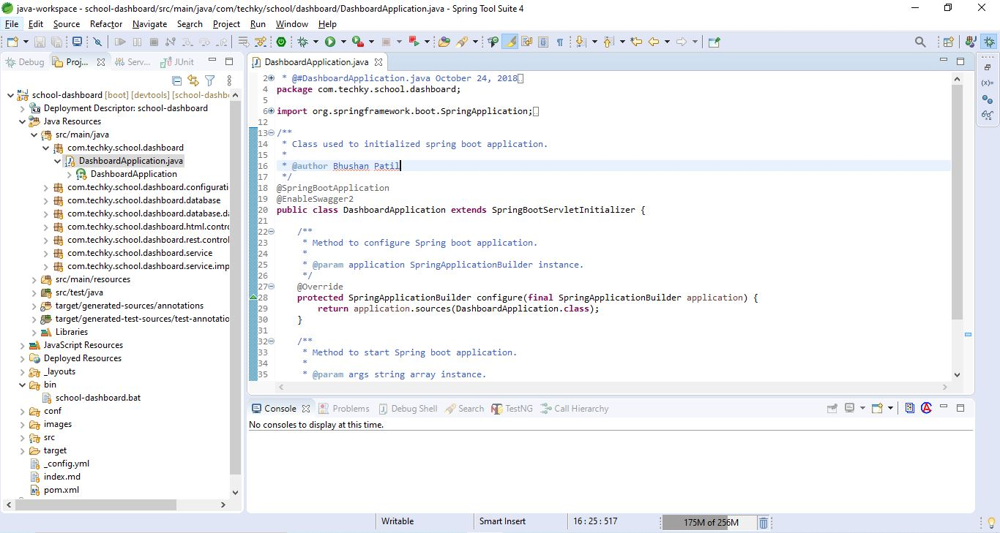

- This project must need to convert from a General to a Maven project. Right mouse click on the project and select Configure -> Convert to Maven project.

- Update maven project. Right mouse click on the project and select Maven -> Update Maven Project.
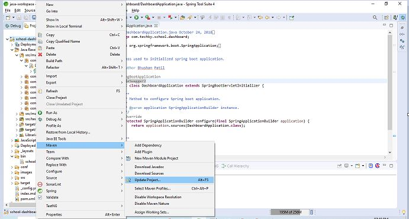

- As a final step, you should build your project. In Eclipse you build a Maven project by right-mouse clicking on the project and selecting Run As -> 4 Maven Build.
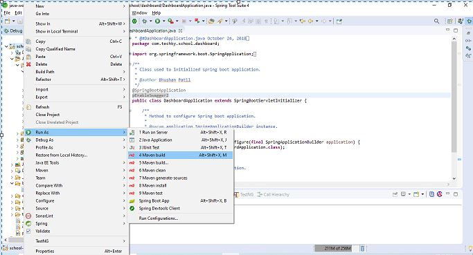

- Open 'DashboardApplication' with 'CTRL + SHFIT + T' and run application as 'Spring Boot Application'
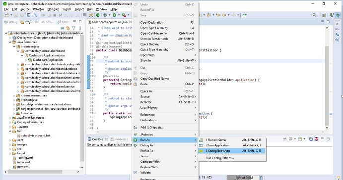

### Configuring Project into Circle CI:


### Important Links:

| Description | Link |
| -------- | -------- |
| Source Code | <span style="color: green;font-weight: bold;"><a href="https://github.com/ravaan-techky/school-dashboard/archive/master.zip"><i class="fa fa-download"></i></a></span> |
| Circle CI <If Available> | Not Available |
| Documentation | <span style="color: green;font-weight: bold;"><a href="https://ravaan-techky.github.io/school-dashboard/"><i class="fa fa-folder-open"></i></a></span> |
  
### Application Gallery:

  | <i class="fa fa-picture-o"></i> | <i class="fa fa-picture-o"></i> | <i class="fa fa-picture-o"></i> |
  | -------- | -------- | -------- |
  | School Dashboard<br/><br/><a href="images/dashboard.jpg">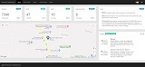<a/> |  Notice List<br/><br/><a href="images/notice_list.jpg">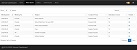<a/> | Notice Detail<br/><br/><a href="images/notice_details.jpg">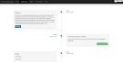</a> |
  | School Gallery<br/><br/><a href="images/school_gallery.jpg">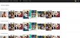<a/> |  Achievements<br/><br/><a href="images/achievements.jpg">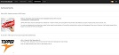<a/> | About Us<br/><br/><a href="images/about.jpg">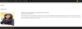</a> |

### Developer Information:

| Description | Github Profile Link  | LinkedIn Profile Link | Email Address
| -------- | -------- | -------- | -------- |
| Vaishali Patil | [<i class="fa fa-external-link"></i>](https://github.com/ravaan-techky/) | [<i class="fa fa-external-link"></i>](https://www.linkedin.com/in/vaishali-patil-4a6679143/) | [ravaan.techky@gmail.com](mailto:ravaan.techky@gmail.com) |

<br/><br/>
[<i class="fa fa-arrow-left"></i> **Back**](/documentation/)
